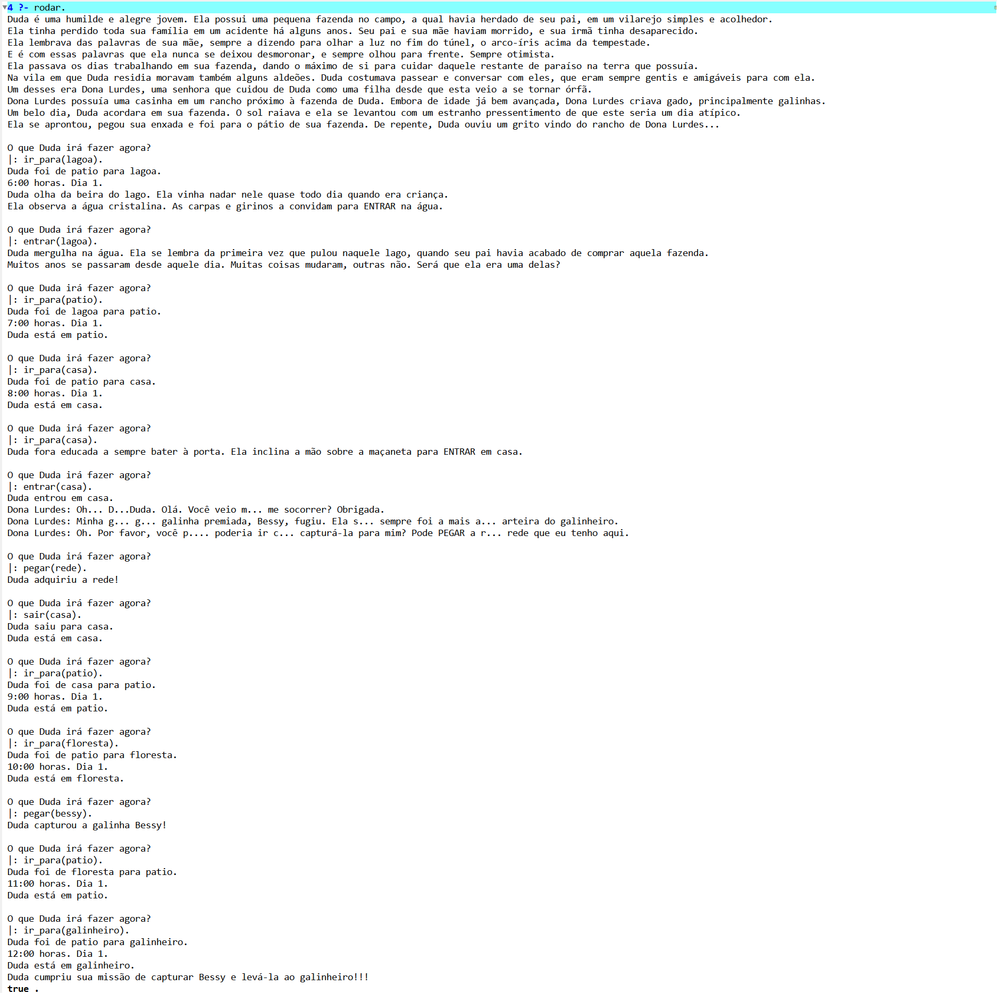

# Jogo de Aventura em Prolog

Projeto acadêmico desenvolvido individualmente no 2º semestre de 2023 durante a graduação em Engenharia de Computação na UTFPR.

### Sobre o projeto

Jogo de aventura baseado em comandos, desenvolvido em Prolog, no qual o jogador controla as ações e decisões de uma personagem em um mundo composto por diferentes locais, itens, personagens e eventos.

O projeto utiliza regras lógicas para controlar o estado do jogo, as ações disponíveis, os requisitos para determinadas ações, a progressão temporal e os diferentes caminhos que podem levar aos finais da história.

### Tecnologias

- Prolog

### Dependências

- SWI-Prolog

### Principais características
- Gerenciamento dinâmico do estado do jogo
- Sistema de localização e deslocamento entre áreas
- Inventário e gerenciamento de recursos
- Sistema temporal com progressão de horas e dias
- Regras condicionais para ações e eventos
- Diálogos com NPCs dependentes do estado atual do jogo
- Entrada de dados do usuário para nomeação de um personagem (filho/filha)
- Múltiplos finais possíveis

### Demonstração

### Execução

O jogo é executado diretamente pelo terminal utilizando o interpretador SWI-Prolog.
